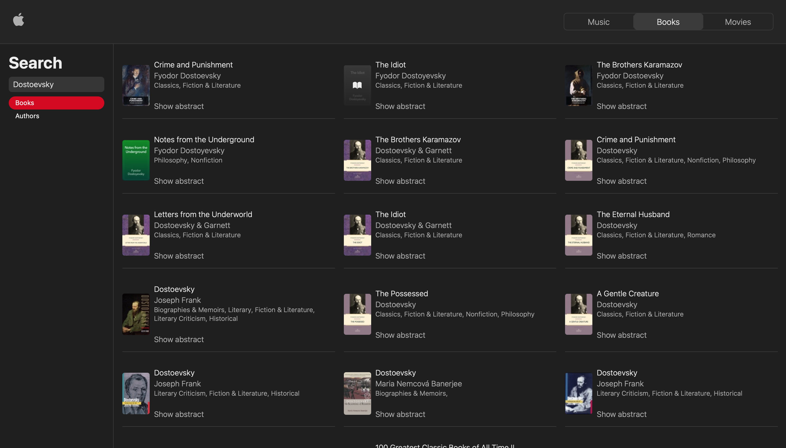

# Fetching data in React Exercise

This is a proyect for the MIT xPro Professional Certificate in Coding.

The objetive of this exercise was lern how to use "useEffect", "useReducer", and how to fetch data from react.

In a second part of the project I implemented a navigation bar with three buttons that bring us two new views: Movies and Books. To do this I used web components (custom elements) and vanilla JS hash routing.

## Usage

This was one of the ReactJS projects developed for the fullstack MITxPro program. In this case, I created a React app to search for Apple Music songs, artists, albums, or music videos. Plus, you have two additional views for searching for books and movies. I used the iTunes Search API for this task.

You could see this app working in this link: https://jbdigital.online/applemusic/

## Instalation

If you want to use this code, download or clone this repository, and write in your terminal (in this proyect root)one of the folowing codes:

### For development

npm run start

### For Production

npm run build

## Support

If you need any help just contact me by email: javier@javierbenavides.com

## Lisence

MIT License

Copyright (c) 2021 Javier Benavides

Permission is hereby granted, free of charge, to any person obtaining a copy of this software and associated documentation files (the "Software"), to deal in the Software without restriction, including without limitation the rights to use, copy, modify, merge, publish, distribute, sublicense, and/or sell copies of the Software, and to permit persons to whom the Software is furnished to do so, subject to the License conditions.
